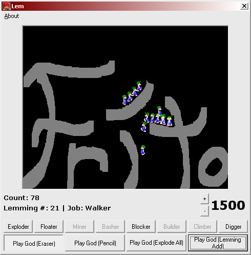



## Kill Lemmings Demo With Regular Timers

### Description

This is a demo program showing how someone could make a lemmings type game. This code uses bitblt with regular timers and is quite slow (because of regular timers). Check out the other version I will post with ccrp timers. Note: I do not have any affiliation with the creators of the game Lemmings, nor is this program complete, I just made it for fun.
 
### More Info
 
If you have a slow computer, your computer may crash.

             |
---                |---
**Submitted On**   |2001-12-17 22:52:32
**By**             |[Peter Rosconi](https://github.com/Planet-Source-Code/PSCIndex/blob/master/ByAuthor/peter-rosconi.md)
**Level**          |Advanced
**User Rating**    |5.0 (10 globes from 2 users)
**Compatibility**  |VB 6\.0
**Category**       |[Games](https://github.com/Planet-Source-Code/PSCIndex/blob/master/ByCategory/games__1-38.md)
**World**          |[Visual Basic](https://github.com/Planet-Source-Code/PSCIndex/blob/master/ByWorld/visual-basic.md)
**Archive File**   |[Kill\_Lemmi4277712172001\.zip](https://github.com/Planet-Source-Code/peter-rosconi-kill-lemmings-demo-with-regular-timers__1-29903/archive/master.zip)

